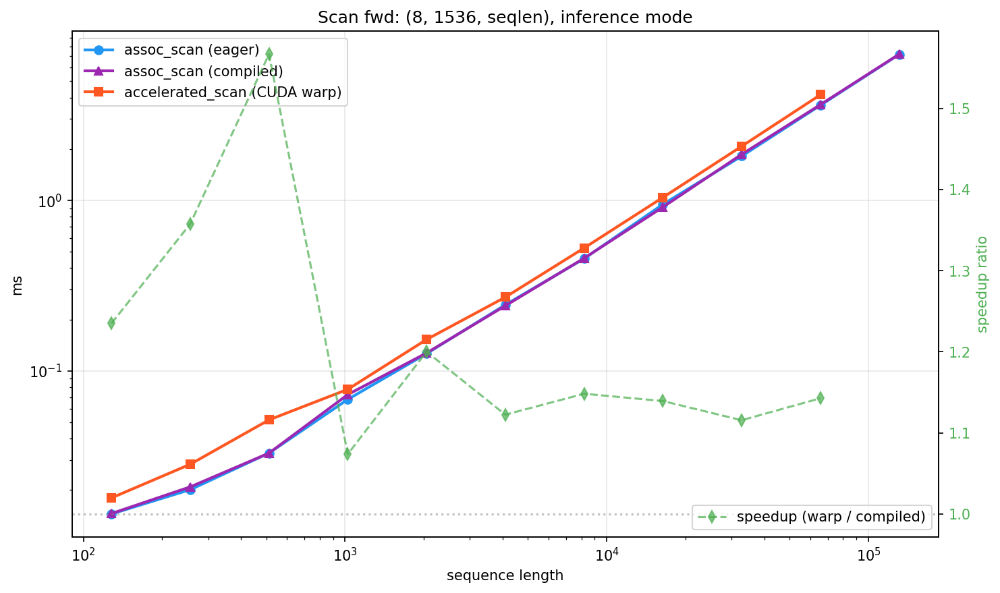

# associative_scan_triton

Chunked [associative scan](https://en.wikipedia.org/wiki/Prefix_sum#Parallel_algorithms) for the first-order linear recurrence `h[t] = g[t] * h[t-1] + x[t]`, implemented in [Triton](https://github.com/triton-lang/triton). Supports variable-length sequences (packing via `cu_seqlens`), bidirectional operation, and `torch.compile`.

The recurrence is the core primitive behind gated linear RNNs (Griffin, Mamba, RWKV, xLSTM, etc.), but this implementation is architecture-agnostic — it only computes the scan.

## quick start

```python
import torch
from associative_scan_triton import scan_causal, get_grid

# 4 channels, single sequence of length 128
C, T = 4, 128
device = "cuda"

gates = torch.rand(C, T, device=device, requires_grad=True)
tokens = torch.randn(C, T, device=device, requires_grad=True)
cu_seqlens = torch.tensor([0, T], device=device, dtype=torch.int32)

grid = get_grid(len(cu_seqlens), T, chunk_size=128, no_channels=C)
args = {"cu_seqlens": cu_seqlens, "chunk_size": 128, "grid": grid}

# forward scan: h[t] = gates[t] * h[t-1] + tokens[t]
output = scan_causal(gates, tokens, args)
output.sum().backward()  # gradients flow through
```

For bidirectional scans (two branches, opposite directions):

```python
from associative_scan_triton import scan_bidirectional_branched

y_fwd, y_bwd = scan_bidirectional_branched(
    gates_fwd, tokens_fwd, gates_bwd, tokens_bwd, args
)
```

For `torch.compile`-compatible code paths, use the `_compiled` variants:

```python
from associative_scan_triton import scan_bidirectional_branched_compiled

y_fwd, y_bwd = scan_bidirectional_branched_compiled(
    gates_fwd, tokens_fwd, gates_bwd, tokens_bwd, args
)
```

## install

```bash
uv add associative-scan-triton --git https://github.com/PheelaV/associative-scan-triton.git
```

Or for development:

```bash
git clone git@github.com:PheelaV/associative-scan-triton.git
cd associative-scan-triton
uv sync
```

Requires PyTorch >= 2.10 and Triton >= 3.6 (ships with recent PyTorch).

## what's in the box

| File | What it does |
|------|-------------|
| `_kernels.py` | Triton JIT kernels: `op`, `forward_scan_chunked`, `forward_scan_onepass_pipelined` |
| `_dispatcher.py` | `forward_scan_full` — routes single-chunk vs multi-chunk (pipelined) |
| `_shift_pad.py` | `shift_pad` (eager, torch.roll) + `shift_pad_compiled` (Triton kernel) |
| `_grid.py` | `get_grid`, `get_static_grid`, `next_power_of_2` |
| `scan_eager.py` | `scan_causal`, `scan_bidirectional_branched` — autograd-compatible |
| `scan_compiled.py` | `scan_bidirectional_branched_compiled` — `torch.compile`-compatible via `@triton_op` |

## performance

Scan kernel forward pass on H100 80GB, config `(B=8, C=1536, seqlen)`, inference mode. Compared against [accelerated-scan](https://github.com/proger/accelerated-scan) (CUDA warp-level implementation). The Triton 1-kernel onepass beats the CUDA warp scan across all sequence lengths, and scales beyond its 65K limit:



| seqlen | ours (ms) | warpscan (ms) | speedup | cumulative avg speedup |
|-------:|----------:|--------------:|--------:|-----------------------:|
| 128 | 0.0139 | 0.0178 | 1.28x | 1.28x |
| 256 | 0.0194 | 0.0283 | 1.46x | 1.37x |
| 512 | 0.0331 | 0.0515 | 1.56x | 1.43x |
| 1024 | 0.0719 | 0.0778 | 1.08x | 1.34x |
| 2048 | 0.1276 | 0.1522 | 1.19x | 1.31x |
| 4096 | 0.2369 | 0.2691 | 1.14x | 1.28x |
| 8192 | 0.4584 | 0.5247 | 1.14x | 1.26x |
| 16384 | 0.9117 | 1.0400 | 1.14x | 1.25x |
| 32768 | 1.8176 | 2.0733 | 1.14x | 1.24x |
| 65536 | 3.5752 | 4.1640 | 1.16x | 1.23x |
| 131072 | 7.1413 | — | — | — |

To run the benchmark yourself:

```bash
CUDA_VISIBLE_DEVICES=0 uv run --group bench python bench/bench_vs_warpscan.py
```

## how it works

The scan is split into fixed-size chunks. For a single chunk, `tl.associative_scan` runs entirely in SRAM. For multiple chunks, a single-kernel pipelined pass propagates the running prefix across chunks with software pipelining (`tl.range(num_stages=N)`) to overlap loads with compute.

Variable-length sequences are handled via `cu_seqlens` (cumulative sequence lengths, same convention as flash-attn). Each sequence is scanned independently — no cross-document leakage.

The backward pass computes `d_tokens` via a reverse scan on shifted gates, and `d_gates = shifted_states * d_tokens`.

## tests

```bash
CUDA_VISIBLE_DEVICES=0 uv run python -m pytest tests/ -v
```

Tests covering kernel numerics, forward/backward correctness against JAX reference (`jax.lax.associative_scan`), shift-pad, and compiled-vs-eager parity.

## license

MIT
