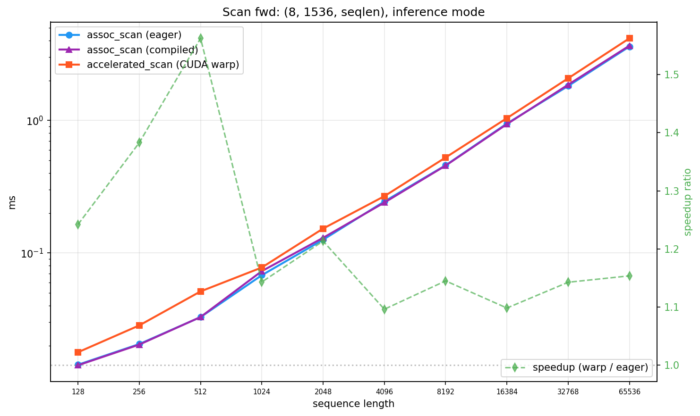
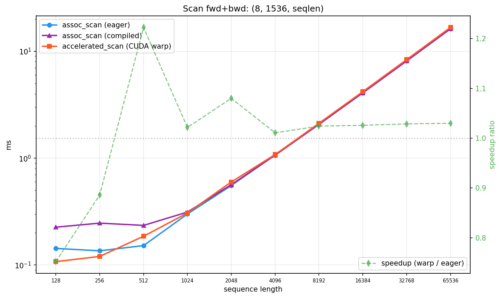
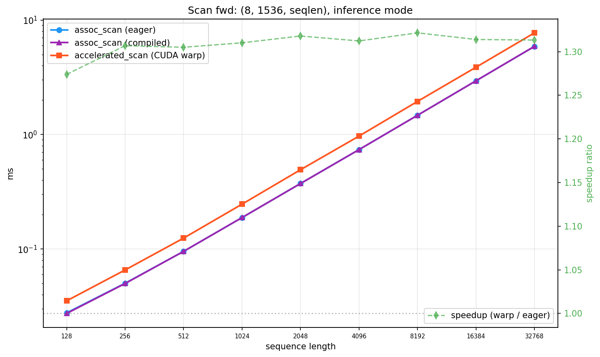
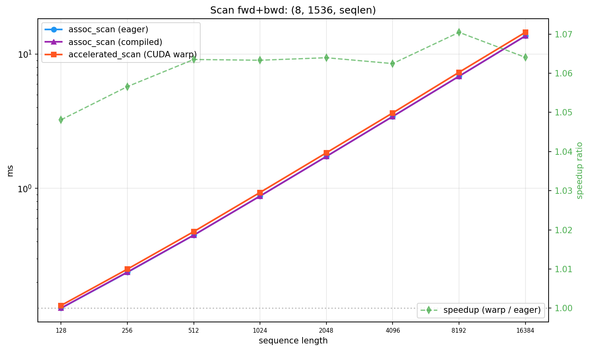
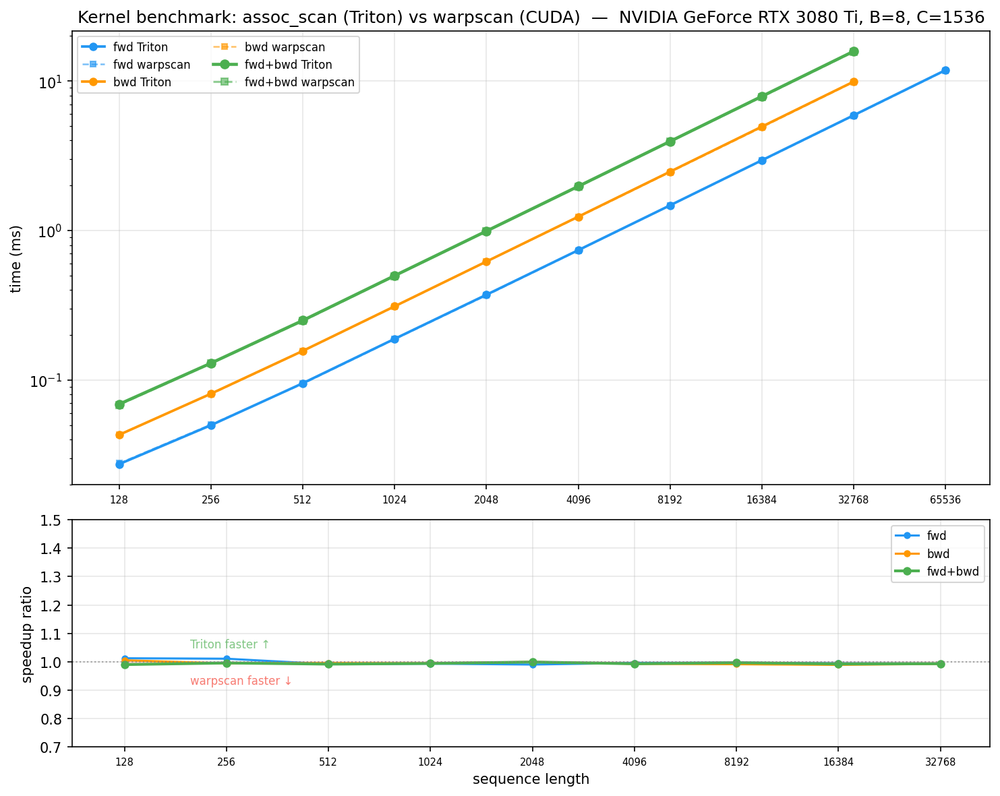
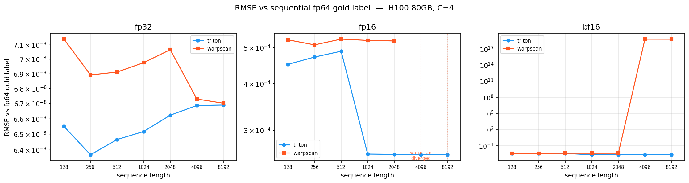

# associative_scan_triton

Chunked [associative scan](https://en.wikipedia.org/wiki/Prefix_sum#Parallel_algorithms) for the first-order linear recurrence `h[t] = g[t] * h[t-1] + x[t]`, implemented in [Triton](https://github.com/triton-lang/triton). Supports variable-length sequences (packing via `cu_seqlens`), bidirectional operation, and `torch.compile`.

The recurrence is the core primitive behind gated linear RNNs (Griffin, Mamba, RWKV, xLSTM, etc.), but this implementation is architecture-agnostic — it only computes the scan.

## quick start

```python
import torch
from associative_scan_triton import scan_causal, get_grid

# 4 channels, single sequence of length 128
C, T = 4, 128
device = "cuda"

gates = torch.rand(C, T, device=device, requires_grad=True)
tokens = torch.randn(C, T, device=device, requires_grad=True)
cu_seqlens = torch.tensor([0, T], device=device, dtype=torch.int32)

grid = get_grid(len(cu_seqlens), T, chunk_size=128, no_channels=C)
args = {"cu_seqlens": cu_seqlens, "chunk_size": 128, "grid": grid}

# forward scan: h[t] = gates[t] * h[t-1] + tokens[t]
output = scan_causal(gates, tokens, args)
output.sum().backward()  # gradients flow through
```

For bidirectional scans (two branches, opposite directions):

```python
from associative_scan_triton import scan_bidirectional_branched

y_fwd, y_bwd = scan_bidirectional_branched(
    gates_fwd, tokens_fwd, gates_bwd, tokens_bwd, args
)
```

For `torch.compile`-compatible code paths, use the `_compiled` variants:

```python
from associative_scan_triton import scan_bidirectional_branched_compiled

y_fwd, y_bwd = scan_bidirectional_branched_compiled(
    gates_fwd, tokens_fwd, gates_bwd, tokens_bwd, args
)
```

## install

With `pyproject.toml`:
```bash
uv add associative-scan-triton --git https://github.com/PheelaV/associative-scan-triton.git
```
with `.venv`:
```bash
uv pip install git+https://github.com/PheelaV/associative-scan-triton.git
```

Or for development:

```bash
git clone git@github.com:PheelaV/associative-scan-triton.git
cd associative-scan-triton
uv sync
```

Requires PyTorch >= 2.10 and Triton >= 3.6 (ships with recent PyTorch).

## what's in the box

| File | What it does |
|------|-------------|
| `_kernels.py` | Triton JIT kernels: `op`, `forward_scan_chunked`, `forward_scan_onepass_pipelined` |
| `_dispatcher.py` | `forward_scan_full` — routes single-chunk vs multi-chunk (pipelined) |
| `_shift_pad.py` | `shift_pad` (eager, torch.roll) + `shift_pad_compiled` (Triton kernel) |
| `_grid.py` | `get_grid`, `get_static_grid`, `next_power_of_2` |
| `scan_eager.py` | `scan_causal`, `scan_bidirectional_branched` — autograd-compatible |
| `scan_compiled.py` | `scan_bidirectional_branched_compiled` — `torch.compile`-compatible via `@triton_op` |

## performance

Benchmarks on H100 80GB and RTX 3080 Ti 12GB, `(B=8, C=1536, seqlen)`, compared against [accelerated-scan](https://github.com/proger/accelerated-scan) (hand-tuned CUDA warp-level implementation). Timed with `triton.testing.do_bench()` (CUDA events, L2 cache cleared between reps).

### PyTorch API

Measured through the PyTorch API — `scan_causal()` vs `warp_scan()` — including autograd, input validation, and dispatch overhead.



**Forward-only (inference)**: Consistently faster at all sequence lengths (~10-15%).



**Fwd+bwd (training)**:

| seqlen | ours (ms) | warpscan (ms) | speedup |
|-------:|----------:|--------------:|--------:|
| 128 | 0.143 | **0.108** | 0.75x |
| 256 | 0.136 | **0.120** | 0.89x |
| 512 | 0.152 | 0.186 | **1.22x** |
| 1024 | 0.300 | 0.307 | **1.02x** |
| 2048 | 0.555 | 0.599 | **1.08x** |
| 4096 | 1.069 | 1.081 | **1.01x** |
| 8192 | 2.070 | 2.120 | **1.02x** |
| 16384 | 4.087 | 4.193 | **1.03x** |
| 32768 | 8.126 | 8.359 | **1.03x** |
| 65536 | 16.238 | 16.724 | **1.03x** |

At small seqlens (128-256), warpscan's lighter autograd path wins. At seqlen >= 512, we're faster or equal. The `_compiled` variants (`@triton_op`) exist for `torch.compile` compatibility — so the scan doesn't cause a graph break when the outer model is compiled. They run the same kernels.

<details>
<summary><b>RTX 3080 Ti 12GB</b> (Ampere)</summary>



**Forward-only (inference)**: ~30% faster than warpscan across all sequence lengths.



**Fwd+bwd (training)**: Consistently ~6% faster at all seqlens (no small-seqlen penalty seen on H100):

| seqlen | ours (ms) | warpscan (ms) | speedup |
|-------:|----------:|--------------:|--------:|
| 128 | 0.128 | 0.134 | **1.05x** |
| 256 | 0.237 | 0.250 | **1.06x** |
| 512 | 0.448 | 0.476 | **1.06x** |
| 1024 | 0.876 | 0.932 | **1.06x** |
| 2048 | 1.730 | 1.841 | **1.06x** |
| 4096 | 3.434 | 3.648 | **1.06x** |
| 8192 | 6.846 | 7.328 | **1.07x** |
| 16384 | 13.674 | 14.549 | **1.06x** |

</details>

### Kernel-level

Direct kernel calls, no autograd overhead on either side.


#### Fwd+Bwd combined

| seqlen | ours (ms) | warpscan (ms) | speedup |
|-------:|----------:|--------------:|--------:|
| 128 | 0.027 | 0.028 | **1.03x** |
| 256 | 0.043 | 0.053 | **1.22x** |
| 512 | 0.077 | 0.103 | **1.34x** |
| 1024 | 0.161 | 0.155 | 0.96x |
| 2048 | 0.306 | 0.313 | **1.02x** |
| 4096 | 0.602 | 0.542 | 0.90x |
| 8192 | 1.186 | 1.070 | 0.90x |
| 16384 | 2.322 | 2.132 | 0.92x |
| 32768 | 4.602 | 4.264 | 0.93x |
| 65536 | 9.212 | 8.573 | 0.93x |

#### Forward-only

| seqlen | ours (ms) | warpscan (ms) | speedup |
|-------:|----------:|--------------:|--------:|
| 128 | 0.014 | 0.015 | **1.00x** |
| 256 | 0.020 | 0.024 | **1.20x** |
| 512 | 0.033 | 0.044 | **1.33x** |
| 1024 | 0.068 | 0.061 | 0.90x |
| 2048 | 0.126 | 0.120 | 0.95x |
| 4096 | 0.240 | 0.206 | 0.86x |
| 8192 | 0.455 | 0.401 | 0.88x |
| 16384 | 0.926 | 0.794 | 0.86x |
| 32768 | 1.811 | 1.586 | 0.88x |
| 65536 | 3.606 | 3.185 | 0.88x |

#### Backward-only

Our backward fuses the reverse scan + gate gradient computation into a single kernel. Warpscan uses a separate backward kernel.

| seqlen | ours (ms) | warpscan (ms) | speedup |
|-------:|----------:|--------------:|--------:|
| 128 | 0.020 | 0.020 | **1.02x** |
| 256 | 0.029 | 0.035 | **1.20x** |
| 512 | 0.049 | 0.065 | **1.34x** |
| 1024 | 0.099 | 0.099 | **1.00x** |
| 2048 | 0.186 | 0.199 | **1.07x** |
| 4096 | 0.366 | 0.341 | 0.93x |
| 8192 | 0.722 | 0.674 | 0.93x |
| 16384 | 1.429 | 1.344 | 0.94x |
| 32768 | 2.821 | 2.687 | 0.95x |
| 65536 | 5.623 | 5.394 | 0.96x |

We match or beat warpscan on fwd+bwd at seqlen <= 2048 on H100 (Hopper). At larger sequence lengths, warpscan's hand-tuned CUDA kernel wins by ~7-10% — an inherent [Triton vs CUDA tradeoff](https://github.com/triton-lang/triton/discussions/4472) in scan operations.

<details>
<summary><b>RTX 3080 Ti 12GB</b> (Ampere)</summary>



On Ampere, Triton and warpscan are **essentially tied** (within 1%) across all sequence lengths. The Triton compiler limitations that cause the ~7-10% gap on Hopper don't manifest on this architecture.

#### Fwd+Bwd combined

| seqlen | ours (ms) | warpscan (ms) | speedup |
|-------:|----------:|--------------:|--------:|
| 128 | 0.069 | 0.068 | 0.99x |
| 256 | 0.130 | 0.129 | 1.00x |
| 512 | 0.251 | 0.248 | 0.99x |
| 1024 | 0.499 | 0.496 | 0.99x |
| 2048 | 0.991 | 0.990 | 1.00x |
| 4096 | 1.974 | 1.960 | 0.99x |
| 8192 | 3.944 | 3.931 | 1.00x |
| 16384 | 7.894 | 7.832 | 0.99x |
| 32768 | 15.796 | 15.685 | 0.99x |

#### Forward-only

| seqlen | ours (ms) | warpscan (ms) | speedup |
|-------:|----------:|--------------:|--------:|
| 128 | 0.027 | 0.028 | **1.01x** |
| 256 | 0.050 | 0.050 | **1.01x** |
| 512 | 0.095 | 0.094 | 0.99x |
| 1024 | 0.189 | 0.187 | 0.99x |
| 2048 | 0.372 | 0.368 | 0.99x |
| 4096 | 0.739 | 0.736 | 1.00x |
| 8192 | 1.473 | 1.468 | 1.00x |
| 16384 | 2.949 | 2.932 | 0.99x |
| 32768 | 5.896 | 5.857 | 0.99x |
| 65536 | 11.814 | 11.742 | 0.99x |

#### Backward-only

| seqlen | ours (ms) | warpscan (ms) | speedup |
|-------:|----------:|--------------:|--------:|
| 128 | 0.043 | 0.043 | **1.01x** |
| 256 | 0.081 | 0.081 | 0.99x |
| 512 | 0.157 | 0.156 | 1.00x |
| 1024 | 0.311 | 0.310 | 0.99x |
| 2048 | 0.620 | 0.620 | 1.00x |
| 4096 | 1.237 | 1.228 | 0.99x |
| 8192 | 2.474 | 2.452 | 0.99x |
| 16384 | 4.951 | 4.896 | 0.99x |
| 32768 | 9.900 | 9.824 | 0.99x |

*Note: Backward/fwd+bwd benchmarks cap at seqlen=32768 due to 12GB VRAM (6 tensors needed for backward pass).*

</details>

### When to use which

[accelerated-scan](https://github.com/proger/accelerated-scan) (warpscan) is an excellent hand-tuned CUDA implementation. Choose based on your needs:

| | ours (Triton) | warpscan (CUDA) |
|:---|:---:|:---:|
| Raw kernel speed (H100, seqlen <= 2048) | **faster** | |
| Raw kernel speed (H100, seqlen >= 4096) | | **~10% faster** |
| Raw kernel speed (3080 Ti / Ampere) | **tied** | **tied** |
| PyTorch API speed (H100, fwd+bwd, seqlen < 512) | | **faster** (lighter autograd) |
| PyTorch API speed (H100, fwd+bwd, seqlen >= 512) | **~1-3% faster** | |
| PyTorch API speed (3080 Ti, fwd+bwd) | **~6% faster** | |
| Variable-length sequences | yes (`cu_seqlens`, flash-attn convention) | no (power-of-2, <= 65536) |
| `torch.compile` | yes (`@triton_op`) | graph break (C++ extension) |
| Bidirectional scan | yes | no |
| fp16/bf16 long-sequence stability | fp32 accumulation | native dtype ([overflow at >= 4096](#numerical-accuracy)) |

### Numerical accuracy



RMSE vs sequential fp64 gold label (H100, C=4). Same seqlens across all dtypes — 128 (single-chunk), 512 (single-chunk boundary), 2048 (multi-chunk), 8192 (large multi-chunk):

| dtype | seqlen | ours (RMSE) | warpscan (RMSE) |
|:------|-------:|------------:|----------------:|
| fp32 | 128 | 6.55e-08 | 7.14e-08 |
| fp32 | 512 | 6.46e-08 | 6.91e-08 |
| fp32 | 2048 | 6.62e-08 | 7.07e-08 |
| fp32 | 8192 | 6.69e-08 | 6.70e-08 |
| fp16 | 128 | 4.51e-04 | 5.24e-04 |
| fp16 | 512 | 4.89e-04 | 5.27e-04 |
| fp16 | 2048 | 2.58e-04 | 5.21e-04 |
| fp16 | 8192 | 2.58e-04 | **diverged** (Inf) |
| bf16 | 128 | 3.59e-03 | 3.68e-03 |
| bf16 | 512 | 3.68e-03 | 3.96e-03 |
| bf16 | 2048 | 2.07e-03 | 3.96e-03 |
| bf16 | 8192 | 2.06e-03 | **6.67e+18** (overflow) |

**fp32**: Both implementations are near machine epsilon (~6-7e-08) across all sequence lengths — no meaningful difference.

**fp16/bf16**: Our multi-chunk pipelined kernels (seqlen > 512) upcast loads to fp32 for scan accumulation. Warpscan accumulates in the native dtype, which can overflow at longer sequences. See also warpscan's own [precision notes](https://github.com/proger/accelerated-scan#notes-on-precision).

To run the benchmarks yourself:

```bash
CUDA_VISIBLE_DEVICES=0 uv run --group bench python bench/bench_kernels.py     # speed
CUDA_VISIBLE_DEVICES=0 uv run python bench/bench_accuracy.py                   # accuracy
```

## how it works

The scan is split into fixed-size chunks. For a single chunk, `tl.associative_scan` runs entirely in SRAM. For multiple chunks, a single-kernel pipelined pass propagates the running prefix across chunks with software pipelining (`tl.range(num_stages=N)`) to overlap loads with compute.

Variable-length sequences are handled via `cu_seqlens` (cumulative sequence lengths, same convention as flash-attn). Each sequence is scanned independently — no cross-document leakage.

The backward pass computes `d_tokens` via a reverse scan on shifted gates, and `d_gates = shifted_states * d_tokens`.

## tests

```bash
CUDA_VISIBLE_DEVICES=0 uv run python -m pytest tests/ -v
```

Tests covering kernel numerics, forward/backward correctness against JAX reference (`jax.lax.associative_scan`), fp16/bf16 precision (vs sequential fp64 gold label), shift-pad, compiled-vs-eager parity, and variable-length packing.

## license

MIT
